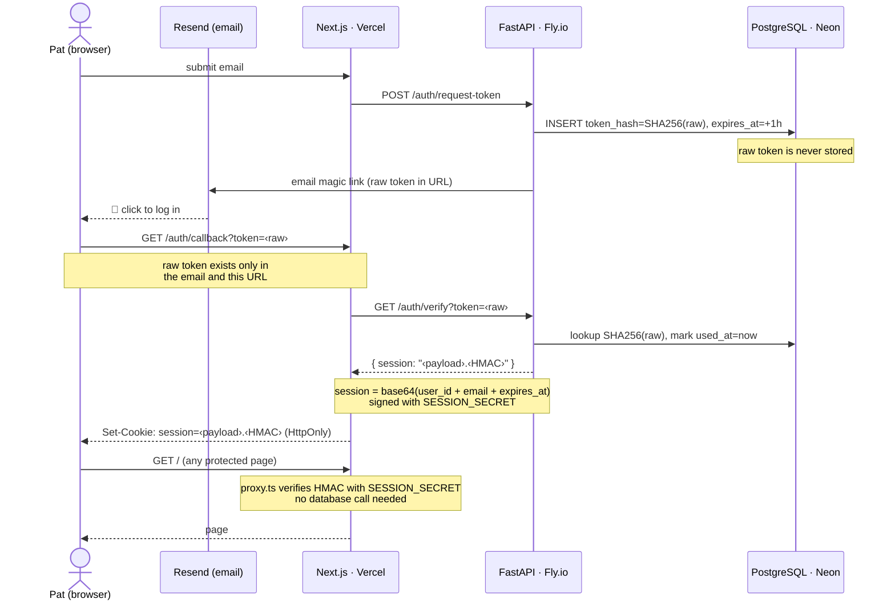

# Authentication

Kintime uses **magic links** — passwordless login via a one-time link sent to your email. No passwords are ever stored.

## Why magic links?

A password system requires storing credentials, handling resets, and protecting against brute-force attacks. Magic links eliminate all of that: the email provider becomes the identity layer, and each link expires after one use.

## Token architecture

Two tokens exist at different points in the flow. Neither is ever in the wrong place at the wrong time.



## Auth token (one-time, short-lived)

When Pat requests a link, the backend generates a random token with `secrets.token_urlsafe(32)` — 32 random bytes from the OS, URL-safe encoded. This raw token is emailed to Pat and **never stored**.

What is stored is its **SHA-256 hash**. This serves two purposes at once:

- **Lookup key** — SHA-256 is deterministic: the same raw token always produces the same hash. When Pat clicks the link, the backend re-hashes the raw token from the URL and uses that hash to find the matching record in the DB. No raw token is needed in the DB, and none is stored there.
- **One-way security** — SHA-256 cannot be reversed. If the database were leaked, the hashes would be useless — an attacker would need the raw token from Pat's inbox to reconstruct them.

The token record has:
- `expires_at` — 1 hour from creation; rejected after that
- `used_at` — set when the link is clicked; rejected if already set (prevents replay attacks)

## Session cookie (long-lived, stateless)

After a successful login, the backend issues a **session value** that encodes Pat's identity and is cryptographically signed. It has two parts joined by a dot:

```
<base64url-encoded-payload>.<HMAC-SHA256-signature>
```

**Payload** — a JSON object, base64url-encoded:
```json
{ "user_id": "...", "email": "pat@example.com", "expires_at": "2026-07-05T..." }
```

**Signature** — HMAC-SHA256 of the encoded payload, using `SESSION_SECRET` (a secret key known only to the server). HMAC is like a tamper seal: if anyone modifies the payload (e.g., changes the `user_id`), the signature no longer matches and the session is rejected.

This cookie is set with:
- `HttpOnly` — JavaScript cannot read it, blocking XSS token theft
- `SameSite=Lax` — sent on top-level navigations (clicking a link) but not on background cross-site requests, blocking CSRF
- `Secure` — only sent over HTTPS in production
- `Max-Age=30 days`

## Session verification (no database call)

Every request to a protected page goes through `proxy.ts` (Next.js) or `verify_session()` (Python). Both do the same thing:

1. Split the session value into payload and signature
2. Re-compute the expected HMAC using `SESSION_SECRET`
3. Compare signatures — reject if they don't match
4. Decode the payload JSON and check `expires_at`

Because the signature proves the payload hasn't been tampered with, there is **no need to query the database** on every request. The server trusts its own signature.

To invalidate a session (e.g., logout), the cookie is deleted client-side. There is no server-side session store to update.
