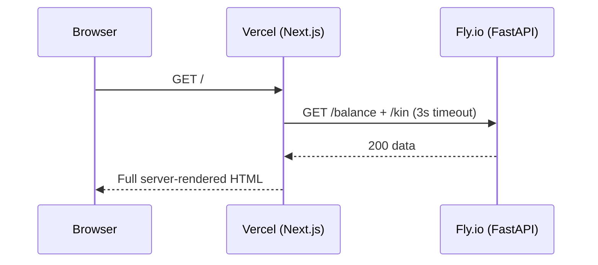
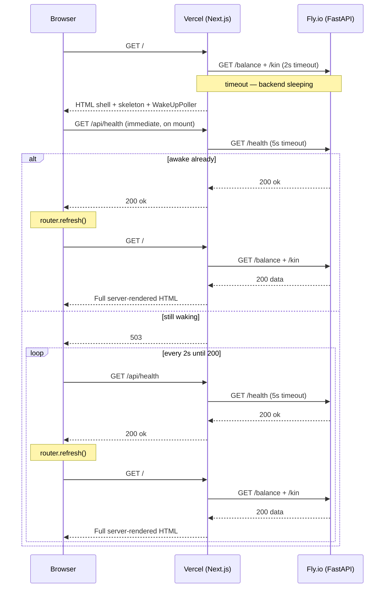

# Cold-start handling

Kintime's backend (Fly.io) auto-stops when idle to stay within the free tier. The first request of the day wakes it — a process that takes 20–30 seconds. This document describes how the frontend handles that wait without leaving the user on a blank page.

## Why a simple loading skeleton isn't enough

The natural Next.js tool for this is `loading.tsx`: place a skeleton file next to `page.tsx` and Next.js wraps the page in a Suspense boundary, streaming the skeleton while the page resolves. In practice this didn't work reliably — Vercel (or the browser) can buffer small initial chunks, so the user still saw a blank tab for the full wake-up duration.

## The approach: server-first with a client-side wake-up poller

The home page uses two modes depending on whether the backend is awake:

### Warm backend (normal path)
`page.tsx` fetches balance and kin data server-side (with a 2-second timeout). If the backend responds in time, the page is fully server-rendered and delivered in one round-trip. No client-side fetching involved.

### Sleeping backend (cold-start path)
If the fetch times out (backend is sleeping), `page.tsx` responds immediately with:
- The page shell and header (from the session cookie — no backend needed)
- An animated skeleton in place of the data sections
- A `<WakeUpPoller />` client component (renders nothing, just runs a timer)

`WakeUpPoller` fires a first health check immediately on mount, then retries every 2 seconds until it succeeds. Each check calls `GET /api/health`, a Route Handler that pings the backend's `/health` endpoint (with a 5-second timeout) and returns 200 when ready, 503 while still waking.

Once `WakeUpPoller` receives a 200, it calls `router.refresh()`. This triggers Next.js to re-run the server components — this time the backend is warm, the 2-second fetch succeeds, and the page re-renders fully server-side with real data.

### Warm backend

### Sleeping backend

## Trade-offs

| Concern              | Impact                                                              |
|----------------------|---------------------------------------------------------------------|
| Cold-start UX        | User sees skeleton for the wake-up duration instead of blank page  |
| Round-trips          | Cold start needs 2 server renders; warm path needs only 1          |
| Architecture         | Data always comes from server-side rendering — no persistent client fetching |
| Complexity           | `WakeUpPoller` adds client-side logic that only runs on cold starts |

The 2-round-trip cost on cold starts is invisible against a 20–30 second wake-up time.
